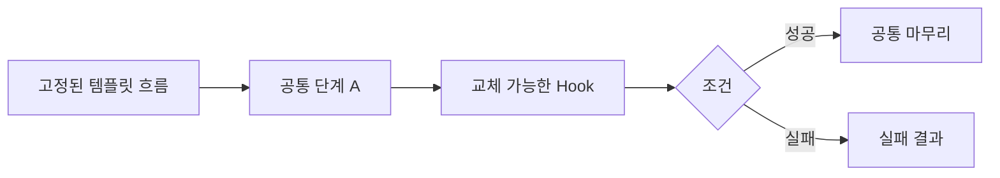
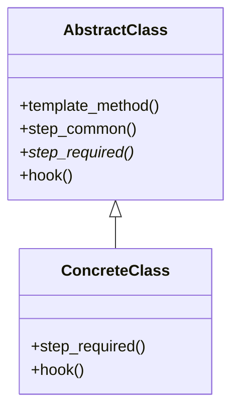

# Template Method

[전체 검토 기준과 학습 순서](../../STUDY_GUIDE.md)

## 핵심 개념

Template Method는 알고리즘의 **큰 순서와 제어 흐름을 고정**하고, 일부 단계만 하위 구현이나 콜백이 바꿀 수 있게 하는 패턴입니다. 호출자는 전체 순서를 다시 조립하지 않고, 정해진 hook만 제공합니다.

## 해결하려는 문제

여러 종류의 데이터 파서, 여러 적 AI, 여러 씬 전환처럼 알고리즘의 전체 흐름은 거의 같은데 일부 단계만 다를 때, 각 구현이 전체 순서를 통째로 복사하면 같은 골격 코드가 여러 곳에 중복됩니다. 공통 흐름을 수정하면 모든 복사본을 함께 고쳐야 합니다.

Template Method는 공통 순서를 한 곳에 고정하고, 달라지는 단계만 재정의 가능한 메서드나 콜백으로 노출합니다. 호출자는 골격을 건드리지 않고 필요한 단계만 채웁니다.





단계에는 세 종류가 있습니다.

- **필수 단계**: 모든 구현이 반드시 채워야 하는 추상 단계입니다.
- **선택 단계**: 기본 구현이 있고 필요할 때만 재정의합니다.
- **hook**: 보통 비어 있고, 중요한 단계 앞뒤에 확장점을 제공하는 선택 단계입니다.

### 역할

- **Template**: 단계의 순서, 공통 처리, 성공·실패 흐름을 소유합니다.
- **Hook**: 호출자가 주입하는 세부 단계입니다.
- **Concrete implementation**: 같은 hook 계약에 맞는 구체 동작을 제공합니다.

전통적인 객체지향 구현은 상속과 메서드 오버라이드로 Template Method를 만들지만, Lua에서는 고정 흐름 함수에 콜백을 전달하는 방식이 더 자연스럽습니다.

## Lua에서의 표현

```lua
local function run(load, transform, save)
	local data = load()
	local result = transform(data)
	return save(result)
end
```

`run`이 순서를 통제하므로 콜백은 순서를 바꿀 수 없습니다. hook이 선택적이라면 기본 함수를 제공하거나 `nil`을 안전하게 처리해야 합니다. 각 단계의 입력·출력 계약을 문서화하지 않으면 콜백 조합이 쉽게 깨집니다.

전통적인 구현은 추상 클래스가 `template_method`를 소유하고 하위 클래스가 단계를 오버라이드합니다. Lua에서는 상속 대신, 순서를 고정한 함수가 필수 콜백과 기본값이 있는 선택 콜백을 받는 방식이 더 자연스럽습니다. 두 표현 모두 핵심은 “호출자가 골격이 아니라 단계만 바꾼다”입니다.

## 도입 절차

1. 알고리즘을 순서가 있는 단계로 나눕니다.
2. 모든 구현에 공통인 단계와 항상 달라지는 단계를 구분합니다.
3. 공통 순서를 template method에 고정하고, 공통 단계는 기본 구현으로 둡니다.
4. 달라지는 단계는 필수 단계로, 선택적 확장은 hook으로 노출합니다.
5. 각 변형마다 필수 단계를 구현하고 필요한 hook만 재정의합니다.
6. 호출자가 template method의 순서를 바꾸지 못하게 계약을 명확히 합니다.

## 예제별 학습 순서

- `example_01.lua`: `load -> parse`의 고정 순서와 두 필수 단계(콜백)를 확인합니다.
- `example_02.lua`: 게임 시작 골격에서 필수 단계, 기본 hook, 재정의 hook을 구분합니다.
- `example_03.lua`: Encode 후 Write 순서를 고정한 저장 흐름을 보여줍니다.
- `example_04.lua`: Input -> Move -> Draw 순서를 고정한 게임 업데이트 흐름입니다.
- `example_05.lua`: 사용자 읽기 후 검사, 성공 시 승인이라는 조건부 hook을 보여줍니다.

## 다른 패턴과의 차이

- **Template Method**: 전체 순서는 고정하고 일부 단계만 교체합니다. 상속과 오버라이드 기반이라 컴파일·정의 시점에 결정됩니다.
- **Strategy**: 알고리즘 전체를 하나의 교체 가능한 전략으로 바꿉니다. 합성 기반이라 런타임에 교체할 수 있습니다.
- **Factory Method**: Template Method의 특수한 형태로, 하나의 “객체 생성 단계”를 하위가 바꾸는 경우입니다. Template Method의 한 단계가 Factory Method일 수 있습니다.

### 참고: Pipeline과의 대비

**Pipeline(파이프라인)은 GoF 패턴이 아니라 단계 조합 기법**입니다. 여러 단계를 순서대로 이어 붙여, 앞 단계의 출력을 다음 단계의 입력으로 흘려보내는 구조입니다.

둘 다 “순서가 있는 단계”를 다루지만 주도권이 반대입니다.

- **Template Method**: 고정된 골격이 순서를 소유합니다. 단계 구성(개수·순서)은 템플릿이 정하고, 호출자는 정해진 지점(hook)만 채웁니다.
- **Pipeline**: 호출자(조립 코드)가 단계 목록을 소유합니다. 단계를 추가·제거·재정렬해 구성 자체를 동적으로 바꿀 수 있습니다.

간단한 Lua 예시로 비교하면 차이가 명확해집니다.

```lua
-- Template Method: 순서가 run 안에 고정되어 있고, 콜백은 정해진 지점만 채운다
local function run(load, parse)
	local raw = load()      -- 1단계 고정
	return parse(raw)       -- 2단계 고정 (순서를 바꿀 수 없음)
end

-- Pipeline: 단계 목록을 호출자가 소유하고, 구성을 자유롭게 바꾼다
local function pipeline(input, stages)
	local value = input
	for _, stage in ipairs(stages) do
		value = stage(value)
	end
	return value
end

local double = function(n) return n * 2 end
local inc = function(n) return n + 1 end

-- 단계를 마음대로 늘리거나 순서를 바꿀 수 있다
pipeline(3, { double, inc })         -- (3*2)+1 = 7
pipeline(3, { inc, double })         -- (3+1)*2 = 8
pipeline(3, { double, double, inc }) -- (3*2*2)+1 = 13
```

게임에서는 자주 헷갈리는 구분입니다. 매 프레임의 “입력 읽기 → 상태 갱신 → 렌더링”처럼 **고정된 생명주기 흐름**은 Template Method가, 데미지 계산이나 후처리 셰이더처럼 **단계를 상황에 따라 끼웠다 뺐다 하는 구성**은 Pipeline이 적합합니다. Pipeline은 패턴이 아니므로 여기서는 순서가 자주 바뀌는 경우와의 대비용으로만 언급합니다.

## 장점과 비용

- 큰 알고리즘에서 호출자가 특정 단계만 바꾸게 하고 나머지는 변경으로부터 보호합니다.
- 공통 골격 코드를 한 곳으로 모아 중복을 없앱니다.
- 반대로 제공된 골격이 호출자를 제약할 수 있고, 단계가 많아지면 template method 유지보수가 어려워집니다.
- 선택 단계의 기본 동작을 하위가 비워 버리면 흐름의 기대가 깨질 수 있으므로 각 단계의 계약을 지켜야 합니다.

## 게임 개발 시나리오

공통 골격은 고정하고 일부 단계만 하위가 재정의할 때 Template Method가 유용합니다.

- **공통 게임 루프 훅**: 초기화 → 입력 처리 → 업데이트 → 렌더링 골격을 고정하고, 각 씬이 `onUpdate`, `onDraw` 훅만 재정의해 일관된 진행 순서를 보장합니다.
- **적 기본 행동 골격**: "감지 → 이동 → 공격" 흐름은 고정하고, 구체적인 감지 범위·공격 방식만 각 적 타입이 채웁니다.
- **씬 생명주기 템플릿**: `load` → `enter` → `update`/`draw` → `exit` 순서를 고정해, 각 씬이 훅만 구현하면 전환 흐름이 같아집니다.
- **미니게임 공통 진행**: 시작·라운드·정산 골격을 고정하고 규칙 부분만 교체합니다.

## Lua와 LÖVE2D에서의 유용성

- 게임 시작·종료·저장처럼 순서가 중요한 생명주기 흐름
- 입력 읽기 → 게임 상태 갱신 → 렌더링 같은 프레임 처리
- 여러 파일 형식의 로드·변환·저장 과정
- 인증, 검증, 리소스 초기화처럼 성공·실패 순서가 고정된 작업

순서가 자주 바뀌거나 알고리즘 전체를 교체해야 한다면 Strategy나 파이프라인 구성(동적 단계 조합)이 더 적절합니다. Lua에서는 콜백이 외부 상태를 암묵적으로 변경하지 않도록 하고, 템플릿 함수가 예외·`nil` 반환을 어떻게 처리할지 명확히 정해야 합니다.
